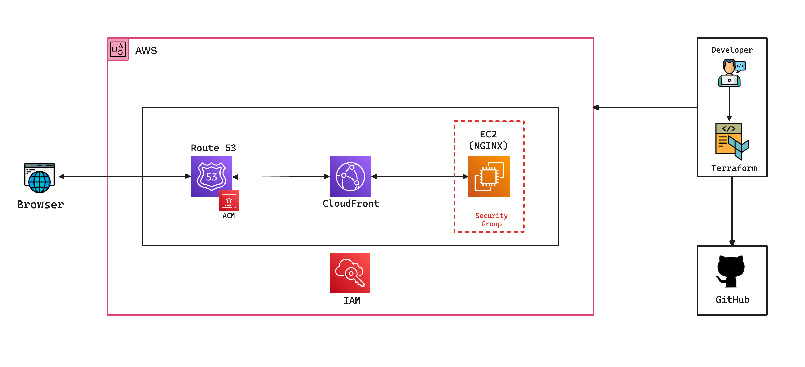

## Architecture

<a href="public/ProjectBlogArch.txt" target="_blank">View Architecture Detail</a>

## Table of Contents

- [Overview](#overview)
- [Features](#features)

## Overview

Creating my first personal blog site in my attempt to practice frontend development and website hosting over a Linux server, distributed using Terraform and a shell script.

This project encapsulates the full lifecycle of a modern web application, from design and development to deployment and continuous integration. It's a comprehensive showcase of utilizing a variety of technologies and services, primarily focusing on React for frontend development and AWS services for hosting and deployment.

## Features

- **Automated Infrastructure Deployment:** Use Terraform to automatically deploy and configure AWS resources, ensuring a consistent and repeatable infrastructure setup.
- **Efficient Resource Management:** Provision and manage EC2 instances, security groups, and other AWS resources with Terraform, reducing manual configuration efforts.
- **Scalable Frontend Hosting:** Deploy a React-based frontend on an EC2 instance, leveraging Nginx for efficient web server management and serving static content.
- **Domain Management:** Utilize Route 53 for domain name management, seamlessly integrating with CloudFront for content distribution.
- **Secure Connections:** Implement HTTPS using AWS ACM for SSL/TLS certificates, ensuring secure communication between users and the web application.
- **Content Distribution:** Leverage CloudFront as a Content Delivery Network (CDN) to deliver web content with low latency and high transfer speeds.
- **Dynamic Configuration:** Use shell scripts to handle dynamic configuration tasks, such as setting up Nginx and managing file permissions, enhancing deployment flexibility.
- **Version Control:** Manage infrastructure as code with Git, enabling version tracking, collaboration, and efficient rollbacks.
- **Cross-Platform Compatibility:** Ensure the solution works across different environments and operating systems, providing a robust and versatile deployment strategy.
- **Enhanced Security:** Secure SSH access to EC2 instances using IAM roles and policies, and control inbound traffic with finely-tuned security group rules.
- **Enhanced Security:** Secure SSH access to EC2 instances using IAM roles and policies, and control inbound traffic with finely-tuned security group rules.
